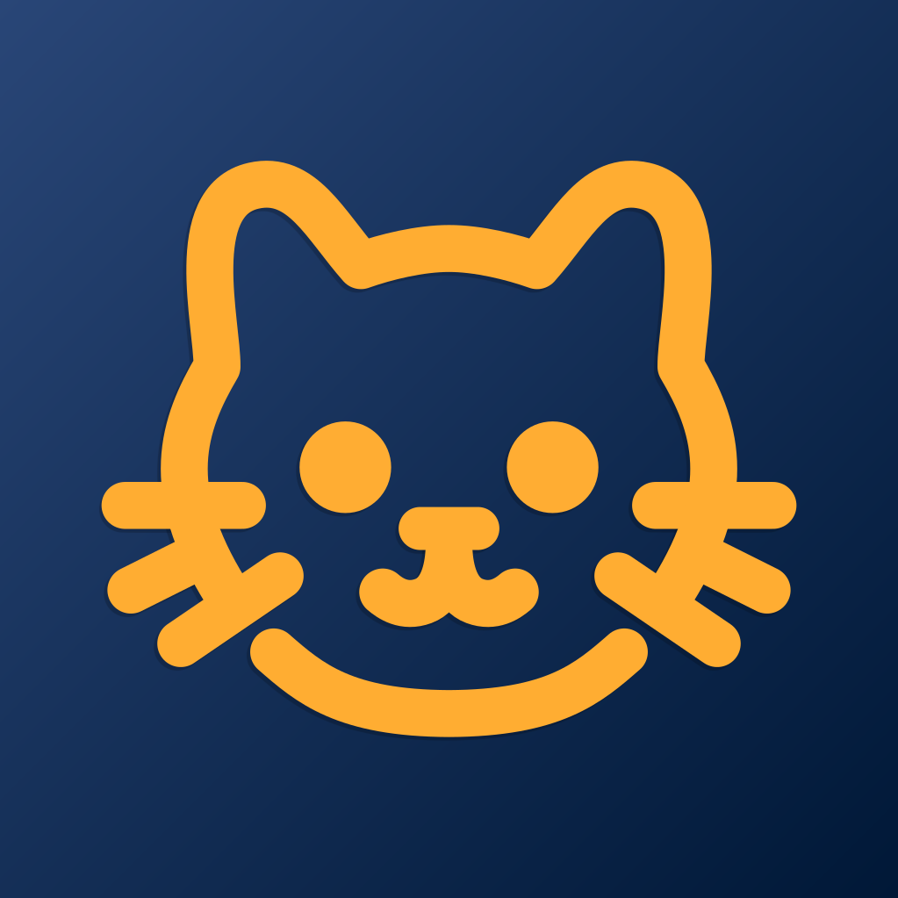

<div align="center">


# KomaruGram Go

Telegram Desktop клиент, написанный с нуля на языке Go. Обладает богатым функционалом и повышенным уровнем безопасности. Легко собирается и распространяется свободно на условиях минимально ограниченной лицензии.

[ [English](README.md) | [Русский] ]

[ [Прочее](./docs/README_FULL.md) | [Виджеты и UI](./docs/UI_COMPONENTS.md) ]

</div>

## Почему этот проект существует?

У официального клиента Telegram Desktop и его форков есть ряд недостатков: сильная зависимость от C++ кодовой базы и библиотек (TDLib, Qt), затратный по времени и ресурсам компьютера процесс сборки, а также высокий порог входа для разработки собственных модификаций. Кроме того, они используют copyleft лицензию, тогда как наш репозиторий полностью свободен в плане условий распространения.

## Что внутри?

За UI отвечает Gio — кроссплатформенная библиотека, работающая по принципу immediate mode GUI. Выбор пал на нее, поскольку она позволяет избежать типичных ограничений фреймворков, не имеет зависимостей, не нарушает кроссплатформенную сборку, полностью совместима с Wayland и легко переносится на другие платформы.

gotd/td реализует MTProto и некоторые дополнительные возможности, служащие основой для любого взаимодействия с протоколом Telegram.

wazero используется в качестве высокопроизводительной WebAssembly песочницы для отрисовки стикеров. Это обеспечивает кроссплатформенность и гарантирует изоляцию кода без запуска отдельного процесса.

FFmpeg, mpv, VLC и Chromium доступны в качестве внешних интеграций, которые необходимо предоставить самостоятельно. Однако приложение будет работать и без них, если пользователя это устраивает.

## С чего начать

Создайте копию этого репозитория. Убедитесь, что на вашем компьютере установлен **Go 1.27.1** — это минимально необходимая версия. В Linux могут потребоваться библиотеки разработки Wayland и X11.

**Перейдите в директорию, где находится точка входа:**
```
cd cmd/messenger
```

### **Linux:**
**Просто сделайте go build:**
```
GOOS=linux go build -ldflags="-s -w" -buildvcs=false -o komarugram
```

### **Windows:**

**Установите Gio cmd тулзы**:
```
go install gioui.org/cmd/gogio@latest
```
**Сборка приложения с иконкой:**
```
gogio -ldflags="-s -w" -icon=../../assets/logo_round.png -target=windows -o komarugram.exe .
```

Процесс сборки может потребовать до 4 ГБ оперативной памяти. Учитывайте это и закрывайте ненужные приложения во время первой сборки. Все последующие сборки должны выполняться практически мгновенно.

## Вайбкодинг

Код в этом проекте был написан преимущественно языковыми моделями GPT-6 Astra и Claude Opus 5.5. За концепцию, выбор стека технологий и библиотек, а также за контроль качества отвечает сопровождающий проекта.

## Благодарности

Мы благодарим создателя gotd/td за отличную библиотеку, а также Gio — за архитектуру, которая одновременно проста и масштабируема для больших приложений. Брендинг предоставлен бесплатно проектом [t.me/komarugram](https://t.me/komarugram). Спасибо augustwise и SvatoshGPT за предоставленные подписки на Claude Code и Codex под нужды этого проекта.

## Лицензия

При работе с этим проектом у вас нет никаких лицензионных обязательств в отношении изменения или распространения кода. Некоторые зависимости требуют соблюдения авторских прав, но не накладывают ограничений на сам код (используются разрешительные лицензии, совместимые с MIT).